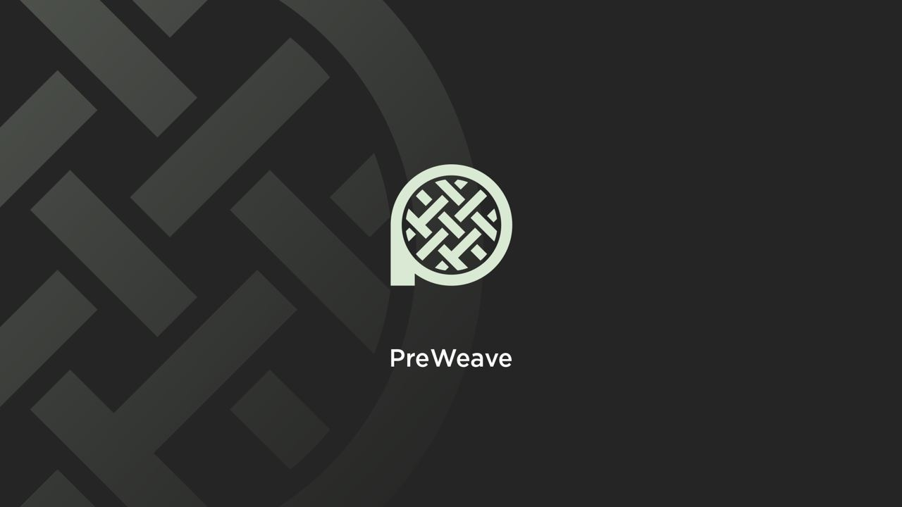

# PreWeave

In this document we describe PreWeave, an optional service in front of the Arweave network that allows users to create and use decentralized IDs for their content, without immediately committing the data for storage.

At the PreWeave node operator’s discretion, content from this service can be moderated, replicated on other PreWeave nodes, and/or dispatched to the Arweave network for permanent storage.

## How to run PreWeave node

Requirements:
- Running instance of Postgres
- Setup .env based on .env.example

Install dependencies:
```yarn install```

Build node:
```yarn build```

Migrate DB:
```yarn migrate:latest```

Run node:
```yarn run```

### Mirroring/Cloning another node

You're able to boostrap your node by cloning all exportable of another node. This is provided via the CLI.

```ts-node cli mirror <node-url>```

e.g. ```ts-node cli mirror https://example.preweave.io```

### Exporting transactions

You're able to export transactions from the local cache on to Arweave via Bundlr. This is done via a single CLI command.

```ts-node cli export```

e.g. ```ts-node cli mirror https://example.preweave.io```